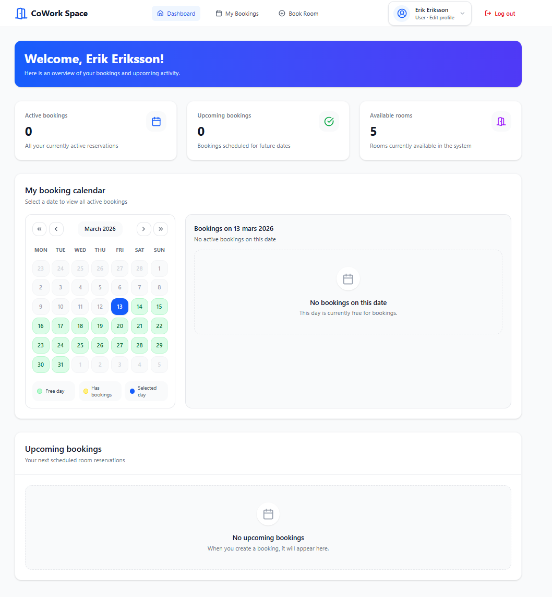
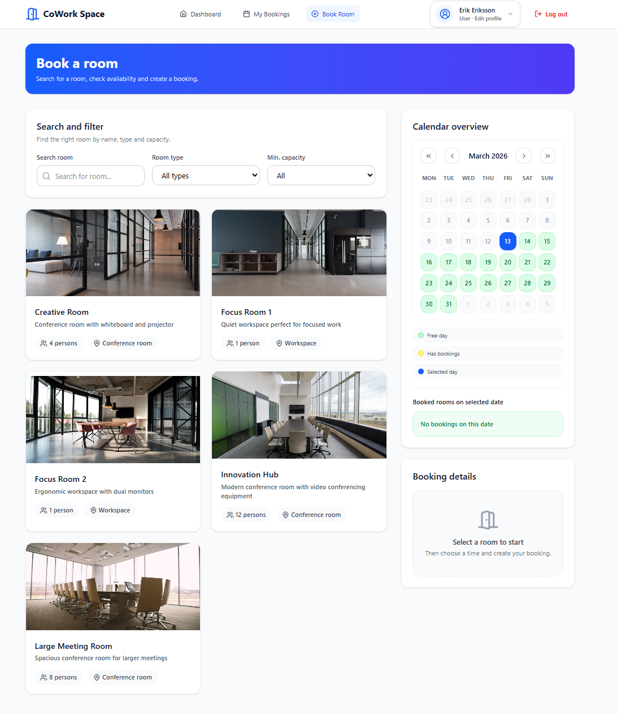
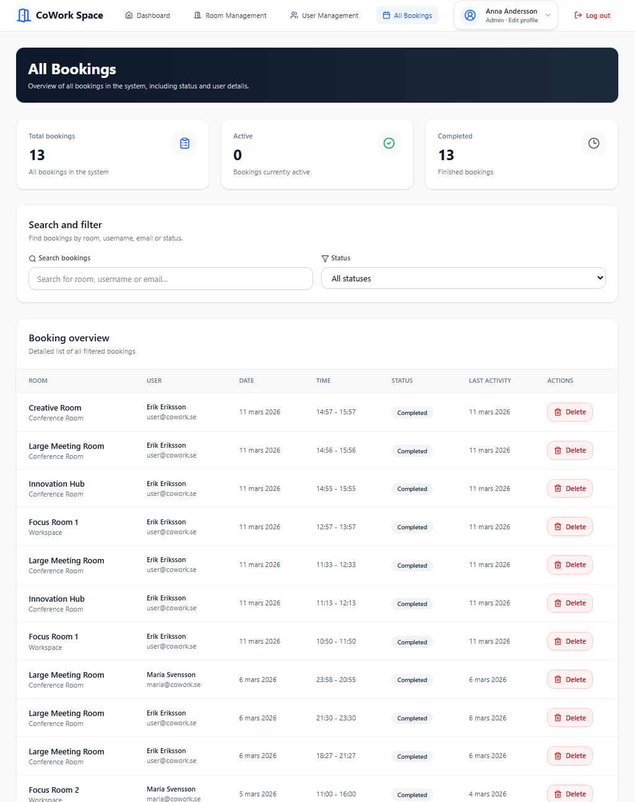

<h1 align='center'>Coworking Space Booking Platform 💼</h1>

<p align="center">A full-stack booking platform where users can register, log in, and book workspaces or conference rooms. Administrators can manage rooms, users, and bookings in real time.</p>

<p align="center">
  
  
  
  
  
</p>

---

## Features

- JWT authentication with role-based access (User/Admin)
- Room management (CRUD)
- Booking management (create, update, delete as owner/admin)
- Live updates with Socket.IO
- Redis room caching (optional)
- Interactive API docs with Swagger

---

## Technologies

- Backend: Node.js, Express.js, MongoDB (Mongoose), Redis, Socket.IO, JWT, bcrypt
- Frontend: React, TypeScript, Vite, Tailwind CSS

---

## Deployment

- Frontend URL: `https://coworking-v6bt.onrender.com`
- Backend URL: `https://coworking-backend-9ngl.onrender.com`
- Swagger URL: `https://coworking-backend-9ngl.onrender.com/api/docs/`

---

## Project Structure

```text
Coworking/
├── backend/
│   └── src/
│       ├── config/
│       ├── controllers/
│       ├── middleware/
│       ├── models/
│       ├── routes/
│       ├── seed/
│       ├── services/
│       └── utils/
├── frontend/
│   └── src/
│       └── app/
│           ├── components/
│           ├── context/
│           └── pages/
└── README.md
```

---

## Getting Started

### Prerequisites

- Node.js v18+
- MongoDB (local or Atlas)
- Redis (optional, rooms are cached if available)

### 1. Clone the repository

```bash
git clone https://github.com/Jojje84/Coworking.git
cd Coworking
```

### 2. Backend setup

```bash
cd backend
npm install
```

Create a `.env` file in `backend/`:

```env
PORT=5000
MONGO_URI=mongodb://localhost:27017/coworking
JWT_SECRET=your_jwt_secret
JWT_EXPIRES_IN=1d
REDIS_URL=redis://localhost:6379
CLIENT_ORIGIN=http://localhost:5173
```

Start backend:

```bash
npm run dev
```

Backend runs on `http://localhost:5000`.
Swagger docs: `http://localhost:5000/api/docs`

### 3. Frontend setup

```bash
cd frontend
npm install
```

Create a `.env` file in `frontend/`:

```env
VITE_API_URL=http://localhost:5000
```

Start frontend:

```bash
npm run dev
```

Frontend runs on `http://localhost:5173`.

### 4. Seed data (optional)

```bash
cd backend
node src/seed/seedRooms.js
node src/seed/seedUsersFromMock.js
node src/seed/seedBookingsFromMock.js
```

---

## API Documentation

Full interactive docs are available at `/api/docs` when backend is running.
Live Swagger docs: `https://coworking-backend-9ngl.onrender.com/api/docs/`

### Authentication

| Method | Endpoint | Description |
|--------|----------|-------------|
| POST | `/api/auth/register` | Register a new user |
| POST | `/api/auth/login` | Log in and receive a JWT token |

Register request body:

```json
{
  "username": "anna",
  "email": "anna@example.com",
  "password": "secret123"
}
```

Login request body:

```json
{
  "email": "anna@example.com",
  "password": "secret123"
}
```

Login response:

```json
{
  "token": "<jwt>",
  "user": { "id": "...", "username": "anna", "email": "...", "role": "User" }
}
```

### Rooms

| Method | Endpoint | Auth | Description |
|--------|----------|------|-------------|
| GET | `/api/rooms` | - | Get all rooms |
| POST | `/api/rooms` | Admin | Create a room |
| PUT | `/api/rooms/:id` | Admin | Update a room |
| DELETE | `/api/rooms/:id` | Admin | Delete a room |

Create room request body:

```json
{
  "name": "Conference Room 1",
  "capacity": 10,
  "type": "conference",
  "description": "Large meeting room",
  "imageUrl": "https://..."
}
```

Create room success response (201):

```json
{
  "_id": "67cabc1234567890abcdef12",
  "name": "Conference Room 1",
  "capacity": 10,
  "type": "conference",
  "description": "Large meeting room",
  "imageUrl": "https://example.com/room.jpg",
  "createdAt": "2026-03-11T09:00:00.000Z",
  "updatedAt": "2026-03-11T09:00:00.000Z"
}
```

### Bookings

| Method | Endpoint | Auth | Description |
|--------|----------|------|-------------|
| GET | `/api/bookings` | User/Admin | Get own bookings as User or all bookings as Admin |
| GET | `/api/bookings/calendar` | User/Admin | Get bookings in a date range for calendar view |
| GET | `/api/bookings/availability` | - | Check room availability |
| POST | `/api/bookings` | User/Admin | Create a booking |
| PUT | `/api/bookings/:id` | Owner/Admin | Update a booking |
| DELETE | `/api/bookings/:id` | Owner/Admin | Permanently delete a booking |

`DELETE /api/bookings/:id` is implemented as owner or admin in backend logic.
If the requester is neither owner nor admin, the API returns `403 Not allowed`.

Create booking request body:

```json
{
  "roomId": "<room-id>",
  "startTime": "2026-03-15T09:00:00.000Z",
  "endTime": "2026-03-15T11:00:00.000Z"
}
```

Get bookings response example (GET `/api/bookings`):

```json
[
  {
    "_id": "67cabc1234567890abcdef12",
    "roomId": {
      "_id": "67cabc1234567890abcdef99",
      "name": "Large Meeting Room",
      "capacity": 12,
      "type": "conference"
    },
    "userId": {
      "_id": "67cabc1234567890abcdef55",
      "username": "anna",
      "email": "anna@example.com",
      "role": "User"
    },
    "startTime": "2026-03-11T14:55:00.000Z",
    "endTime": "2026-03-11T15:55:00.000Z",
    "status": "active",
    "createdAt": "2026-03-11T10:00:00.000Z",
    "updatedAt": "2026-03-11T10:00:00.000Z"
  }
]
```

Common error responses:

`409 Room is already booked`

```json
{
  "status": "fail",
  "message": "Room is already booked"
}
```

`401 Unauthorized`

```json
{
  "status": "fail",
  "message": "Unauthorized"
}
```

### Users

| Method | Endpoint | Auth | Description |
|--------|----------|------|-------------|
| GET | `/api/users/me` | User/Admin | Get own profile |
| PATCH | `/api/users/me` | User/Admin | Update own profile or change password |
| GET | `/api/users` | Admin | Get all users |
| POST | `/api/users` | Admin | Create a user |
| PATCH | `/api/users/:id` | Admin | Update a user |
| DELETE | `/api/users/:id` | Admin | Delete a user |

---

## Real-time Notifications (Socket.IO)

The server emits these events when data changes:

| Event | Description |
|-------|-------------|
| `booking:created` | A booking was created |
| `booking:updated` | A booking was updated |
| `booking:deleted` | A booking was deleted |
| `calendar:changed` | Calendar availability changed and should be refreshed |
| `room:created` | A room was created |
| `room:updated` | A room was updated |
| `room:deleted` | A room was deleted |
| `user:created` | A user was registered |
| `user:updated` | A user was updated |
| `user:deleted` | A user was deleted |

Socket authentication is required: pass JWT in `socket.handshake.auth.token`.

---

## Roles

| Role | Permissions |
|------|-------------|
| User | Register, log in, create, update and delete own bookings, update own profile |
| Admin | All User permissions plus manage all rooms, users and bookings |

Role values in API responses are `"User"` and `"Admin"`.
Frontend may map roles internally to lowercase (`"user"`, `"admin"`).

---

## Screenshots

- Dashboard
  

- Book Room page
  

- Admin Bookings page
  

Add your images to `screenshots/` or update these paths to your actual files.

---

## License

This project is licensed under the MIT License.

---

## Contact

👤 Jorge

[](https://github.com/Jojje84) 
&nbsp;
[](mailto:jorgeavilas@icloud.com) 
&nbsp;
[](https://www.linkedin.com/in/jorge-avila-35622030/)